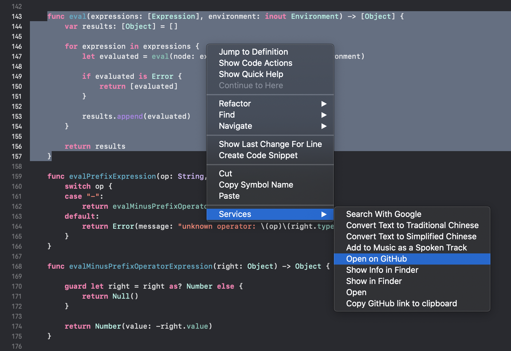
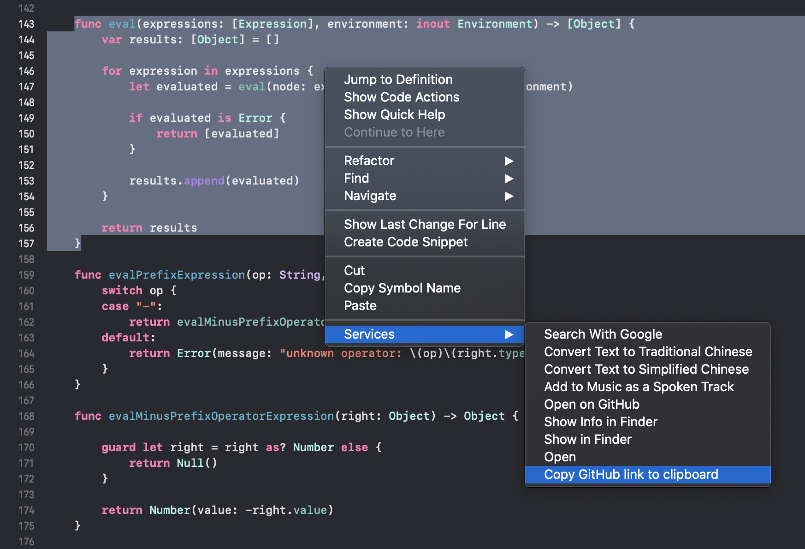

# xcode-open-on-github ⚙️

Quick Actions for Xcode to jump to a source code line on Github or copy GitHub permalink to clipboard.

#### 1️⃣ Open on Github

  

#### 2️⃣ Copy GitHub link to clipboard

  

## Install

Just click the files in quick-actions directory.

## Author

Wojtek Lukaszuk [@wojteklu](http://twitter.com/wojteklu)

## License

This project is licensed under the terms of the MIT license. See the license file.
