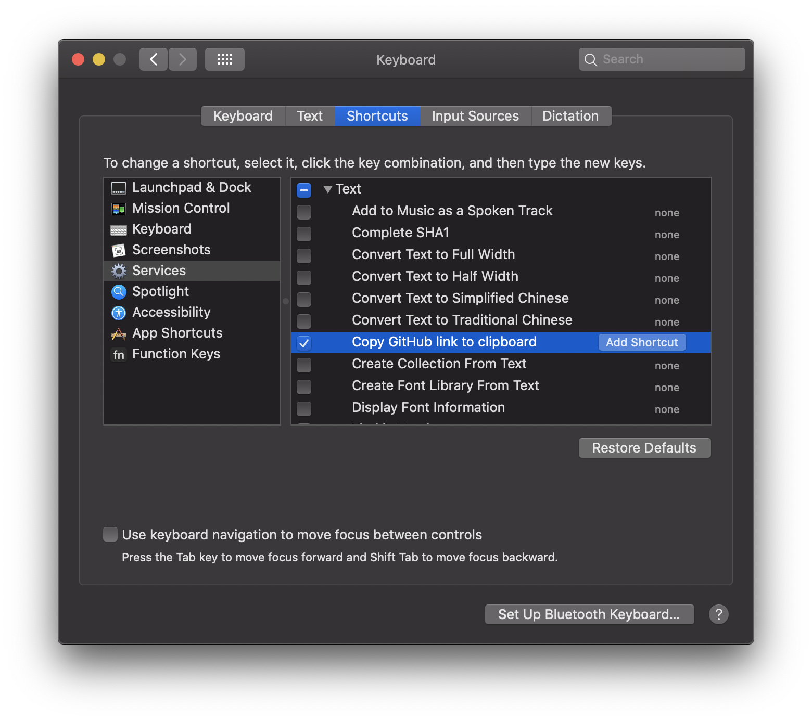
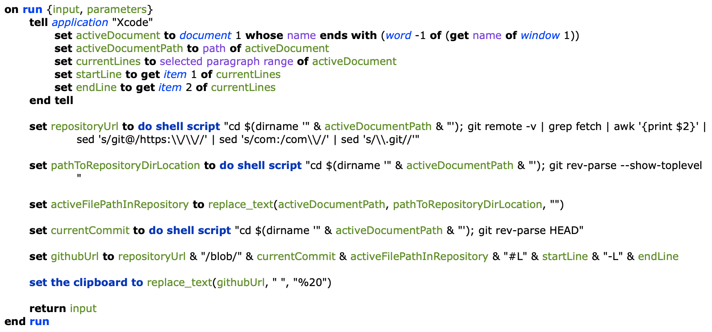

# xcode-open-on-github ⚙️

Quick Actions for Xcode to jump to a source code line on Github or copy GitHub permalink to clipboard. Quick actions for doing the same in Bitbucket are included too.

#### 1️⃣ Open on Github

  

#### 2️⃣ Copy GitHub link to clipboard

  

## Install

Just double-click the files in quick-actions directory to add them to the Services menu.

#### Pro Tip ®
You can create your own keyboard shortcuts for added actions:
1. Open **System Preferences > Keyboard**. Click the **Shortcuts** tab and select **Services** from the list on the left side.
2. Scroll all the way down the list of services. Under the **Text** heading you should find the quick actions you just added. Select it and click **Add Shortcut** to assign a global shortcut.

  

## How it works?

Quick Actions for Xcode are AppleScript scripts. From the Xcode app we get a path of active document and selected lines. Using shell scripts we determine repository URL, current commit and top-level directory of a repository. All that allows constructing a GitHub link.

<table><tr><td>
  
</td></tr></table>

## Author

Wojtek Lukaszuk [@wojteklu](http://twitter.com/wojteklu)

## License

This project is licensed under the terms of the MIT license. See the license file.
